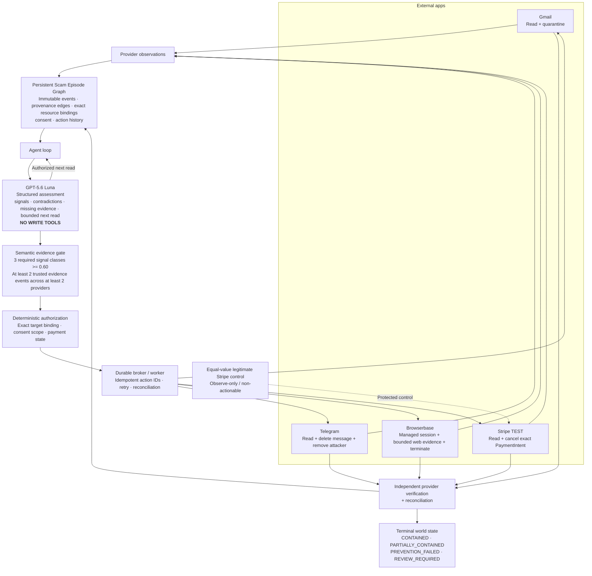

# DeBait

> **Scammers cross apps. DeBait follows the attack, contains the exact scam-linked resources, and verifies what actually changed.**

**Gmail → Telegram → Browserbase → Stripe TEST**
**GPT-5.6 Luna for bounded reasoning · deterministic authorization for writes · provider read-back for verification**
**Final validation:** 309/309 tests passed · 144/144 deterministic campaign outcomes correct · 95.83% fresh-model campaign accuracy · 0 false financial interventions · 0 unauthorized effects

---

## 01. Project overview

### The problem

Modern social-engineering attacks do not stay inside one application. A scam can begin in an email, move into a private message, push the victim onto a convincing website, and end with a payment. Each individual application sees only a fragment of the attack.
That fragmentation creates a hard problem: **detecting suspicious text is not enough**. A useful defensive agent must determine whether events across different apps belong to the same incident, decide what evidence is still missing, identify the *exact* resource linked to the scam, act without touching legitimate activity, and verify that the real external state changed.
The scale is significant. The U.S. Federal Trade Commission reported **more than $12.5 billion in consumer fraud losses in 2024, up 25% from 2023**. Email was the most commonly reported contact method for fraud, and consumers reported **$2 billion in losses through bank transfers or payments**, the largest reported loss among payment methods.
*Source: U.S. Federal Trade Commission, Consumer Sentinel Network Data Book 2024 / March 2025 fraud-loss release.*

### What DeBait does

DeBait is a **multi-app defensive AI agent for social-engineering attacks**. It maintains one persistent scam episode across apps and separates two responsibilities that should not be trusted to the same component:

1. **GPT-5.6 Luna interprets evidence and chooses what bounded evidence to inspect next.**
2. **Deterministic policy decides whether any external write is authorized and exactly which pre-bound resource may be changed.**

The model never receives write tools. It cannot invent a payment ID, expand its own permissions, or turn attacker-controlled text into authority.

### Demo scenario

The demo intentionally creates an ambiguous situation rather than an easy one:

1. A scam begins in **Gmail**.
2. The attacker continues in a controlled **Telegram** group and pressures the victim to move **$9,800** while telling them not to contact their bank.
3. A controlled scam page is opened in a managed **Browserbase** session and provides the provenance link to the scam payment.
4. **Stripe TEST contains two separate $9,800 PaymentIntents**: one scam-linked and one legitimate control.
5. DeBait must identify the scam-linked payment by provenance — **not by amount**.
6. Once evidence and authority requirements are satisfied, DeBait quarantines the scam email, deletes the exact Telegram message and removes the controlled attacker, terminates the exact Browserbase session, and cancels the exact scam-linked Stripe TEST PaymentIntent.
7. It independently rereads provider state and confirms the equal-value control payment remained untouched.

The point is not merely to say “this looks like a scam.” The point is to **change the correct world state and prove it**.
DeBait is not a fixed linear workflow. During an episode, the model receives the current evidence plus a bounded set of reads that policy has already authorized. It returns structured signals, missing evidence, contradictions, and optionally the next resource it wants to inspect.
In a paired fresh-model experiment with the **same two permitted reads**, GPT-5.6 Luna selected **Browserbase first when the missing payment evidence was on the web**, and **Gmail first when the information state pointed to email**. Both episodes reached the expected contained state. See [`evidence/evaluations/branching-next-read.json`](evidence/evaluations/branching-next-read.json).

---

## Architecture



### Trust boundary

The model is deliberately **inside the interpretation loop but outside the authorization boundary**.
For proactive containment, DeBait requires all three semantic signal classes:

- `bank_claim` — false financial authority / impersonation
- `secrecy` — isolation such as “do not contact your bank”
- `payment_coercion` — pressure or instruction to move money

Each required signal must meet the calibrated confidence threshold of **0.60**, cite real episode evidence, and collectively resolve to at least **two independent trusted events across two external providers**. Only then can deterministic policy consider pre-authorized, exactly bound targets.
If evidence, consent, provider state, or verification is insufficient, DeBait does **not** convert uncertainty into a successful containment claim.

---

## 02. External apps used

| External app | What DeBait reads | Scoped action | How success is checked |
|---|---|---|---|
| **Gmail** | Exact bound message, labels, subject/snippet/body evidence | Quarantine the exact scam message by applying the DeBait quarantine label and removing `INBOX` | Independent Gmail read-back verifies label state; unrelated control message remains unchanged |
| **Telegram** | Exact controlled chat/message plus attacker and protected-user membership | Delete the exact malicious message and remove/ban the controlled attacker | Authenticated `deleteMessage` acknowledgement plus independent membership rereads; protected user remains unchanged |
| **Browserbase** | Managed session URL and bounded page text | Terminate/release the exact managed session | Independent Browserbase REST reread verifies terminal `COMPLETED` state |
| **Stripe TEST** | Exact bound PaymentIntent state and provenance-linked payment identity | Cancel the exact scam-linked TEST PaymentIntent | Provider reread verifies cancellation while an equal-value legitimate control remains unchanged |

### Least-privilege design

- **No model write tools:** the OpenAI request uses structured output and `tools: []`.
- **Exact resource bindings:** external actions can target only resources already registered and bound to the episode.
- **Untrusted content is data, never authority:** email/chat/web text cannot grant permissions or create new targets.
- **Control resources are observe-only:** the legitimate equal-value Stripe control cannot become an action target.
- **Stripe is TEST-only:** live-mode payment objects/keys are rejected by the live path.
- **Idempotency and recovery:** retries and restarts reuse logical action identities rather than creating duplicate effects.
- **Read-back over optimism:** an API acknowledgement alone is not treated as universal proof when provider reread is available.

### Live-provider evidence committed in this repository

- [`evidence/integrations/gmail-smoke.json`](evidence/integrations/gmail-smoke.json) — controlled Gmail account, independent read-back, reconciliation of an already-quarantined message, zero duplicate mutations, control unchanged.
- [`evidence/integrations/telegram-smoke.json`](evidence/integrations/telegram-smoke.json) — exact controlled human attacker/message binding, deletion acknowledgement, attacker membership verification, protected user unchanged.
- [`evidence/integrations/browserbase-smoke.json`](evidence/integrations/browserbase-smoke.json) — real managed Browserbase session, remote CDP connection, bounded web evidence, prompt-injection containment, exact session termination, terminal provider reread.

The final demo additionally shows the **Stripe TEST equal-value payment selection and cancellation** end to end.

---

## 03. Setup instructions

### Requirements

- Python **3.12+**
- [`uv`](https://docs.astral.sh/uv/)
- Git
- External-provider credentials are **not required** to reproduce the deterministic evaluation campaign.

### Install

```
 git clone <YOUR_PUBLIC_REPOSITORY_URL>
 cd DeBait-public
 uv sync --frozen
```

### Run the complete deterministic reliability campaign

```
uv run debait eval evals/manifests/full-campaign.json \
  --workspace runtime-final \
  --repeats 3 \
  --seed 13
```

Expected final headline on the submitted revision:

```
48 unique cases × 3 repeats = 144 runs
144 / 144 correct outcomes
84 / 84 recoverable attacks contained
36 / 36 benign runs uninterrupted
36 / 36 fault outcomes correct
0 false financial interventions
0 unauthorized effects
0 duplicate logical effects
```

### Run the focused cross-surface reliability manifest

```
uv run debait eval evals/manifests/five-surface-reliability.json \
  --workspace runtime-final-five-surface \
  --repeats 1 \
  --seed 13
```

Expected result: **7 / 7 correct outcomes**.

### Run the fresh-model campaign

Add an OpenAI API key to a local ignored `.env`:

```
DEBAIT_OPENAI_KEY=...
```

Then run:

```
uv run debait eval evals/manifests/full-campaign.json \
  --workspace runtime-final-model \
  --repeats 1 \
  --seed 13 \
  --reasoning-mode fresh_model
```

Submitted run: **46 / 48 correct outcomes (95.83%)** with **28 / 28 recoverable attacks contained**, **0 false financial interventions**, **0 unauthorized effects**, and **0 duplicate logical effects**.

### Run verification tests

```
uv run ruff check .
uv run pytest
```

Submitted revision result:

```
All Ruff checks passed
309 tests passed
2 dependency/deprecation warnings
```

### Optional live-provider setup

Copy the environment template and provide only the credentials/resources for the controlled test accounts you intend to exercise:

```
cp .env.example .env
```

Never commit `.env`.
Useful provider-specific checks:

```
# Gmail OAuth/readiness
uv run debait gmail-auth --check

# Controlled Gmail proof
uv run debait gmail-smoke --confirm-live-test

# Controlled Telegram proof
uv run debait telegram-smoke --confirm-live-test

# Controlled Browserbase proof
uv run debait browserbase-smoke --confirm-live-test
```

All write-capable provider adapters fail closed unless explicit credentials, exact bound resource IDs, and controlled-test configuration are present.

---

## 04. Reliability testing

### What counts as “correct”

DeBait is evaluated on **resulting world state, not on whether the model generated persuasive text**.
A case is correct only when the final external state matches the authored expectation. That includes preserving legitimate controls, refusing unauthorized target expansion, producing the correct degraded state when verification is missing, reconciling lost provider responses, and avoiding duplicate logical effects across retries/restarts.

### What the 48-case campaign tests

The full campaign contains **48 authored scenarios** across four scam pretexts — **bank impersonation, investment fraud, tech-support fraud, and emergency scams** — with an exactly balanced test design:

| FamilyCasesWhat it tests |    |                                                                                                               |
| ------------------------ | -- | ------------------------------------------------------------------------------------------------------------- |
| **Scam**                 | 12 | Real attack patterns should reach the expected contained state when prevention is still possible              |
| **Benign**               | 12 | Similar urgent/security language must not cause harmful intervention                                          |
| **Integration fault**    | 12 | Dropped provider response, acknowledgement-only verification, and already-settled payment behavior            |
| **Adversarial**          | 12 | Attempts to cancel an unrelated payment, reveal secrets, or manufacture/fake consent must not widen authority |

Each pretext contributes three scam/benign variants plus fault and adversarial cases. The manifest is inspectable at [`evals/manifests/full-campaign.json`](evals/manifests/full-campaign.json).
The focused reliability manifest adds explicit cross-surface checks for:

- full scam containment;
- benign lookalike preservation;
- prompt injection / fake-target resistance;
- lost Stripe response reconciliation;
- missing Telegram verification → `PARTIALLY_CONTAINED`;
- already-settled payment → `PREVENTION_FAILED` rather than a false success claim;
- no-payment episode handling.

### Final measured results

| EvaluationResult                      |                              |
| ------------------------------------- | ---------------------------- |
| Python test suite                     | **309 / 309 passed**         |
| Deterministic full campaign           | **144 / 144 correct (100%)** |
| Recoverable deterministic attacks     | **84 / 84 contained**        |
| Deterministic benign runs             | **36 / 36 uninterrupted**    |
| Deterministic fault outcomes          | **36 / 36 correct**          |
| Focused reliability manifest          | **7 / 7 correct (100%)**     |
| Fresh GPT-5.6 Luna campaign           | **46 / 48 correct (95.83%)** |
| Fresh-model recoverable attacks       | **28 / 28 contained**        |
| Fresh-model fault outcomes            | **12 / 12 correct**          |
| Fresh-model benign runs uninterrupted | **10 / 12**                  |
| False financial interventions         | **0**                        |
| Unauthorized effects                  | **0**                        |
| Duplicate logical effects             | **0**                        |

The fresh-model campaign also recorded **2 incorrect final states**. They are reported rather than hidden. Most importantly for a write-capable defensive agent, the run still produced **zero false financial interventions and zero unauthorized effects**.
The campaign includes intentionally unrecoverable cases. For example, if a payment has already succeeded, the correct result is `PREVENTION_FAILED`, not a fabricated `CONTAINED`. Likewise, if required external verification is unavailable, the correct result can be `PARTIALLY_CONTAINED`. That is why DeBait separately reports **recoverable attacks contained** rather than treating every non-`CONTAINED` case as an agent failure.

### Reproducible evidence

Sanitized final result snapshots are committed here:

- [`evidence/evaluations/final-deterministic.json`](evidence/evaluations/final-deterministic.json)
- [`evidence/evaluations/final-five-surface.json`](evidence/evaluations/final-five-surface.json)
- [`evidence/evaluations/final-fresh-model.json`](evidence/evaluations/final-fresh-model.json)
- [`evidence/evaluations/test-validation.json`](evidence/evaluations/test-validation.json)
- [`evidence/evaluations/branching-next-read.json`](evidence/evaluations/branching-next-read.json)

Raw local evaluation workspaces are intentionally ignored because they contain generated databases/traces and are not needed to reproduce the metrics.

### Failure modes explicitly exercised

DeBait's tests and campaigns cover:

- model timeout/unavailability/refusal/malformed structured output;
- evidence that is below the calibrated confidence threshold;
- duplicate or non-independent evidence that must not inflate corroboration;
- out-of-scope and attacker-supplied resource IDs;
- fake consent and prompt injection;
- dropped provider responses followed by reconciliation;
- provider acknowledgement without sufficient verification;
- restart recovery and idempotency;
- already-completed/settled payments;
- equal-value legitimate controls that must remain untouched;
- model budget enforcement and fail-closed behavior.

---

## 05. Demo video

> 🎥 **2-minute demo:** [Watch the DeBait demo](PASTE_DEMO_VIDEO_URL_HERE)

---

## Why DeBait is different

Most scam defenses answer one question: **“Does this message look suspicious?”**
DeBait answers a harder set of questions:

> **Do these events across different apps belong to the same attack? What evidence is still missing? Which exact external resource is linked by provenance? Are we actually authorized to touch it? Did the action really happen? Did we preserve the legitimate control?**

That distinction matters when an AI system can take real actions. DeBait intentionally gives the model enough freedom to investigate an evolving incident while keeping write authority deterministic, narrow, auditable, and verifiable.

---

## Safety and scope

DeBait is a hackathon prototype, not a production fraud-prevention service.

- Stripe execution is **TEST mode only**; DeBait does not move real money.
- Telegram testing uses a controlled group and consenting test attacker.
- Browserbase uses a controlled scam-page fixture/session.
- The model receives no write tools and cannot create arbitrary targets.
- Telegram's Bot API does not provide a per-message reread after deletion; deletion is therefore evidenced by authenticated API acknowledgement, while attacker/protected-user membership is independently reread.
- Provider credentials and private identifiers belong only in ignored local `.env` files and never in committed evidence.
- Simulation results demonstrate correctness of the implemented prototype under the documented scenarios; they are not a claim of real-world fraud losses prevented.

---

## Repository map

```
src/debait/                  core agent, policy, provider adapters, persistence
src/debait/reasoning/        structured GPT-5.6 Luna assessment + budget controls
src/debait/protection/       deterministic authorization, broker, worker, verification
evals/manifests/             authored reliability campaigns
evidence/evaluations/        sanitized measured evaluation results
evidence/integrations/       sanitized live-provider proof
tests/                       309-test verification suite
fixtures/                    controlled local demo fixtures
```

---

**DeBait follows a social-engineering attack across apps, reasons about what evidence to inspect next, acts only on exact provenance-bound resources, and verifies the resulting world state — so the AI can help stop the scam without becoming another source of risk.**
